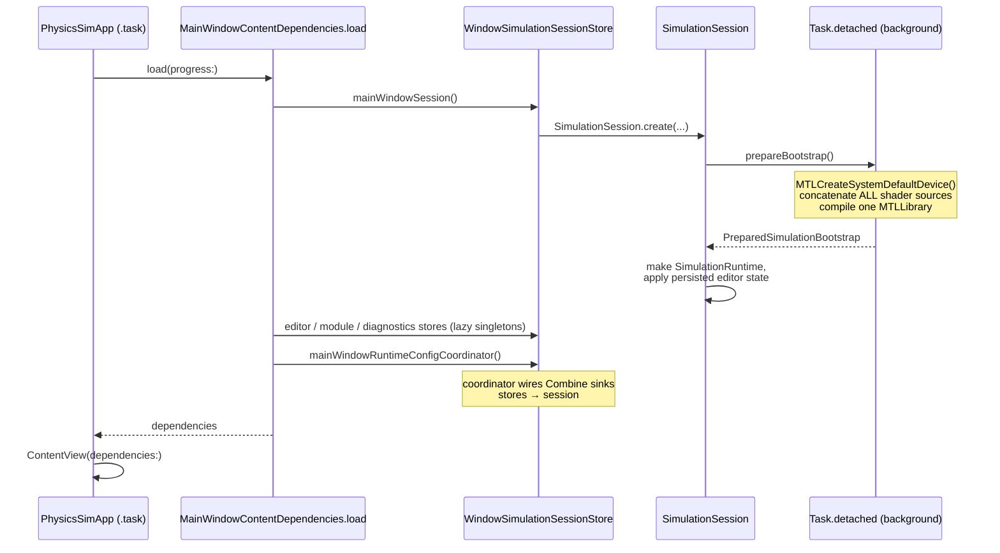
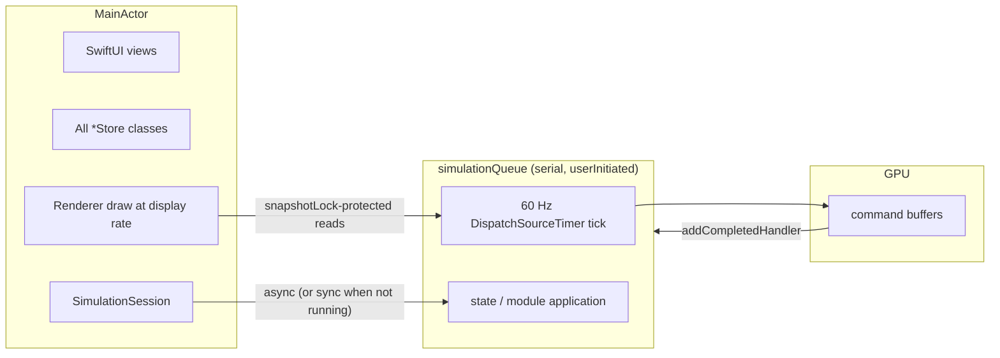

# 01 — System Overview

## What the app is

A single-window macOS app (`Window("Particularity", id: "main-window")`) built with SwiftUI for chrome and Metal for both simulation compute and rendering. The simulation is a particle system in a `[-1, 1]³` cube: every tick, an **optimization** module decides which particles can see each other, a **physics** module accumulates and applies impulses on the GPU, and a **visual** module's shaders draw the result.

Swift package name: `Particularity` (executable target rooted at `Sources/Physics_Sim`, macOS 14+, Swift tools 6.2).

## Directory layout

```
Physics_Sim/
├── Package.swift                  # SwiftPM manifest (target: Particularity)
├── Modules/                       # ← Runtime-discovered module bundles (data, not code)
│   ├── default_grey_spheres/module.json
│   ├── fixed_grid/module.json
│   ├── physics_module_template/   # module.json + module/PhysicsModuleTemplate.metal
│   └── type_matrix_local/         # module.json + module/TypeMatrixLocalPhysicsModule.metal
├── Sources/
│   ├── Physics_Sim/               # All app code
│   │   ├── Shaders/DefaultPhysicsModule.metal   # bundled resource
│   │   └── Modules/Physics/...    # Swift-side companions for packaged modules
│   │                              # (settings types, settings views, runtime helpers)
│   └── lab/                       # Experiments / writeups / issue report data (not built)
├── Tests/ParticularityTests/      # ModuleCompatibilityTests
├── .home/                         # Runtime working dir: logs, testing-API inbox
└── docs/                          # You are here
```

Note the split personality of "Modules": `Modules/` at the repo root holds the *manifests and shader sources* discovered at runtime; `Sources/Physics_Sim/Modules/` holds *compiled-in Swift support code* (settings models, settings UI) for the modules the app knows intimately.

## Launch sequence

`PhysicsSimApp` shows a `LaunchProgressView` and asynchronously loads `MainWindowContentDependencies`, which walks through explicit stages (visible in the launch UI):



Key details:

- **Metal setup happens once, off the main thread.** `SimulationSession.prepareBootstrap()` builds a single `MTLLibrary` from concatenated sources: shared structs (`SimulationMetalSharedSource`) + default visual shaders + the bundled default physics `.metal` resource + every packaged physics module's shader (scanned from `Modules/`) + both optimization modules' compute sources. All GPU pipelines for all known modules come from this one library.
- **Failure is survivable.** If loading throws, `LaunchFailureView` shows the error instead of crashing, so startup failures can be inspected.
- `AppDelegate` supports a headless mode (`PHYSICS_SIM_HEADLESS=1` → emit `APP_HEADLESS_READY`, terminate), used for build/launch verification. On normal launch it starts `TestingCommandHandler` (see doc 07) and emits `APP_READY` on stderr.
- On termination, chrome state, viewport state, and buffered performance samples are flushed.

## Threading model

Three execution contexts matter:



- **Everything user-facing is MainActor**, including `SimulationSession` (a facade) and `Renderer`.
- **`SimulationRuntime` is `@unchecked Sendable`** and does all mutation on its private serial `simulationQueue`. A 60 Hz `DispatchSourceTimer` drives ticks; `simulationWorkInFlight` prevents overlapping GPU submissions.
- **The main-thread render loop never blocks on simulation.** It reads `renderState` / `simulationState` snapshots guarded by a plain `NSLock` (`snapshotLock`); snapshots are republished after every tick and state change.
- Crossings back to MainActor (metrics, leader log, snapshot recording) are done with `Task { @MainActor in ... }`.

## The two state worlds

A recurring pattern to keep in mind everywhere in this codebase:

1. **Editor state** (`SimulationEditorState`) — what the user has configured. Lives in `MainWindowEditorSettingsStore`, persists to UserDefaults, expressed in UI-friendly types (`Double`, module IDs).
2. **Runtime state** (`SimulationViewportState` + `ActiveModuleSet`) — what the simulation is actually executing. Derived from editor state by pure functions in `SimulationConfigurationDerivation`, expressed in GPU-friendly types (`Float`), validated before application.

`SimulationRuntimeConfigCoordinator` is the bridge: it observes editor-side stores via Combine and re-derives + re-applies runtime state whenever anything changes. If validation fails, the derived state is published (so the UI can show issues) but **not** applied to the session. See docs 02 and 05.
