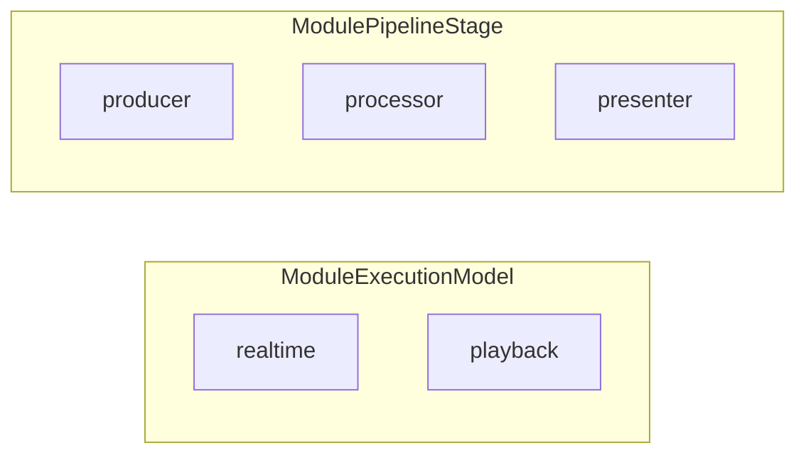
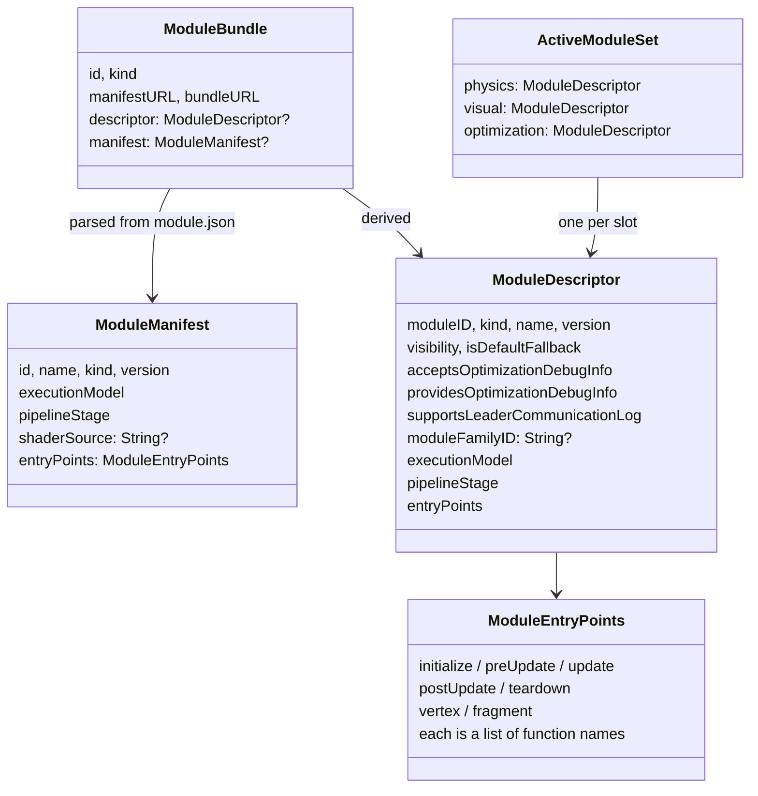
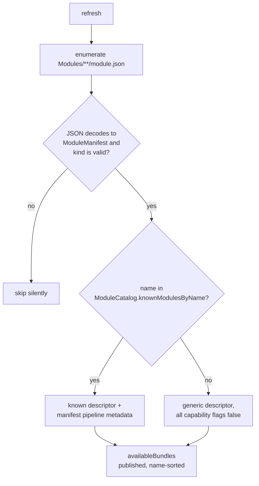
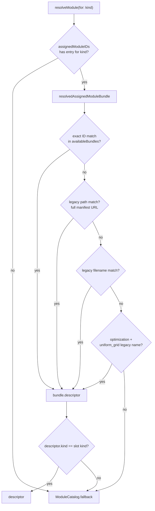
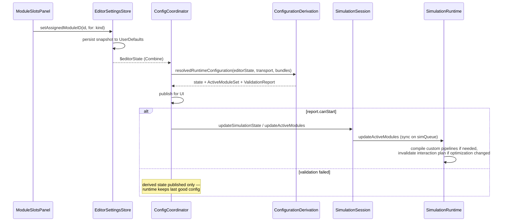
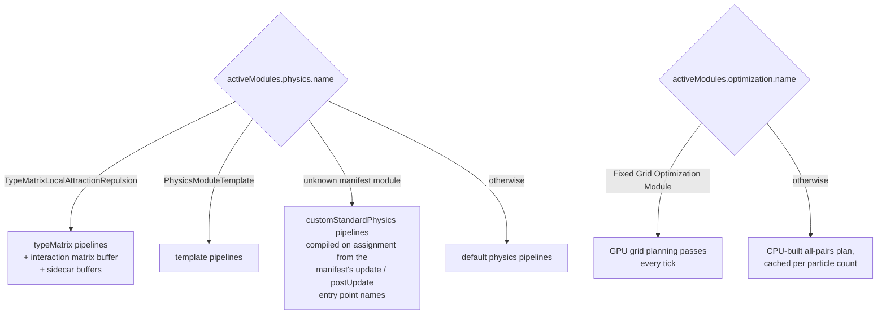

# 02 — Module System

*The current refactor focus: adding a pre-baked **playback** pipeline alongside the realtime one. The last section maps exactly which pieces of playback support already exist and where the seams are.*

## Concepts

Every simulation run is built from **exactly three active modules**, one per pipeline slot. Two orthogonal classifications describe a module's role:



| Stage | Realtime name | Playback name | Job |
|---|---|---|---|
| `producer` | **Optimization** | **Reader** | Produce the interaction plan (realtime) / produce frames from a bake (playback, planned) |
| `processor` | **Physics** | **Processor** | Consume the plan, integrate particle state |
| `presenter` | **Visual** | **Visual** | Shaders that draw the particle buffer |

The display names come from `ModuleRoleMapping.stageName(executionModel:pipelineStage:)`. The legacy `ModuleKind` enum (`physics` / `visual` / `optimization`) is still the primary key used by slots, persistence, and manifests; `ModuleRoleMapping.defaultPipelineStage(for:)` maps kind → stage (optimization→producer, physics→processor, visual→presenter).

## The data types (all in `ModuleRuntime.swift`)



- **`ModuleManifest`** — the decoded `module.json`. Entry point lists accept either a single string or an array (custom `Decodable` logic).
- **`ModuleDescriptor`** — the app's internal, richer view of a module: capability flags, fallback status, family membership. Descriptors exist for modules that have *no* on-disk bundle (the built-in defaults) and are the currency passed to the runtime.
- **`ModuleBundle`** — a discovered folder: manifest + descriptor + URLs.
- **`ActiveModuleSet`** — the resolved trio handed to `SimulationRuntime`. Also computes `completeModuleFamilyID` / `hasPartialModuleFamilySelection` for the playback family rule.

## The module catalog: built-ins vs. discovered

`ModuleCatalog` (static data) defines:

- **Three default fallbacks**, one per kind, with `isDefaultFallback: true` and no on-disk bundle: `DefaultPhysicsSlideLoop`, `DefaultRainbowUnlitSpheres`, `DefaultOptimizationAllPairs`. `ModuleCatalog.fallback(for:)` returns these whenever resolution fails.
- **`knownModulesByName`** — the modules the app has compiled-in support for (`PhysicsModuleTemplate`, `TypeMatrixLocalAttractionRepulsion`, `DefaultGreySpheres`, `Fixed Grid Optimization Module`). When a discovered manifest's `name` matches one of these, the known descriptor (with its capability flags) is used, updated with the manifest's ID/version/execution metadata via `withPipelineMetadata(...)`.

Module ID convention: `<origin>.<executionModel>.<pipelineStage>.<bundle_name>`, e.g. `particularity.realtime.processor.type_matrix_local`; built-ins use the `internal.` prefix.

## Discovery

`MainWindowModuleCatalogStore` (a `@MainActor ObservableObject` singleton) walks up from the working directory to find the project root (`Package.swift` + `Modules/` present), then enumerates `Modules/**/module.json`:



`refresh()` runs at init, on `ContentView.onAppear`, and on demand from the coordinator/UI. Nothing watches the filesystem — it's poll-on-demand.

## Assignment and resolution

The user's choice per slot is stored as `assignedModuleIDs: [String(kind) : moduleID]` inside `SimulationEditorState` (persisted — see doc 05). **No assignment means "use the default fallback."**

Resolution to actual descriptors happens in pure functions in `SimulationConfigurationDerivation`:



The legacy fallbacks exist because assignments used to be stored as file paths; `MainWindowEditorSettingsStore.normalizeAssignedModuleIDs(availableBundles:)` migrates any resolvable legacy value to the canonical bundle ID whenever the catalog changes.

## Validation & compatibility

`ModuleCompatibility.incompatibilityReason(for:state:)` is the single gatekeeper, called from three places: configuration derivation (to build the validation report), `SimulationSession.updateActiveModules` (throws), and `SimulationRuntime.updateActiveModules` (throws, on the sim queue). Rules, in order:

1. **Pipeline role rules** — each slot's descriptor must declare the stage that slot expects (producer/processor/presenter); all three must share **one execution model**; the set must contain exactly one of each stage.
2. **Runtime support rules** — a discovered module that isn't a default and isn't in `knownModulesByName` is only executable if it's a `realtime` `processor` physics module declaring both `update` and `postUpdate` entry points ("the standard realtime processor runtime"). Anything else gets: *"…is discoverable, but this build does not yet support manifest-driven X execution."* — this is the wall the playback refactor is dismantling.
3. **Family rule** — if *any* active module declares a `moduleFamilyID`, all three must declare the same one ("Playback module families must be selected as a compatible physics, visual, and optimization trio.").
4. **Debug capability pairing** — `showOptimizationInfo` requires visual `acceptsOptimizationDebugInfo` and optimization `providesOptimizationDebugInfo`.

Beyond compatibility, `SimulationConfigurationDerivation.validationReport(...)` adds field-tagged issues (`RuntimeValidationIssue`): particle count bounds (1 … 1,000,000 engine cap), missing/unreadable assignments, leader-log support, fixed-grid projected topology memory (256 MB safety limit), and the default optimization module's 65,535-particle cap. The report also carries `projectedBytes` (memory estimate). `canStart == issues.isEmpty` gates the transport controls, and issues flow into UI decoration via environment keys (doc 06).

## From selection to GPU: the full path



## Runtime dispatch: how a descriptor becomes GPU work

`SimulationRuntime` does **not** interpret entry points generically for known modules — dispatch is a name-based switch with one generic escape hatch:



- The **custom standard physics** path (`makeCustomStandardPhysicsPipelinesIfNeeded`) is the first genuinely manifest-driven execution: it looks up the manifest's `update`/`postUpdate` function names in the shared `MTLLibrary` (which already contains the module's shader source, concatenated at bootstrap) and builds compute pipelines on the spot. Custom modules receive the same buffer layout as the template module (`TemplatePhysicsAccumulateParams` / `TemplatePhysicsApplyParams` with hardcoded radius/impulse values).
- The **visual** module currently affects rendering only through capability flags and shader selection at the renderer level; `DefaultGreySpheres` has no dedicated runtime branch.
- All shader source for every module is compiled into **one shared `MTLLibrary`** at session bootstrap (`SimulationSession.prepareBootstrap`), which is why entry point names must be globally unique.

The producer→processor contract is the **interaction plan** buffer set (see doc 03 for buffer details): `groupIndices`, `rangeOffsets`, `rangeTargets`, `ranges`, `indices`, plus optional `scratchParticles`/`scratchToCanonical` in scratch read mode. Any physics processor reads neighbors exclusively through this contract (via the shared Metal helpers `interaction_read_particle` / `interaction_resolve_canonical_index`), which is what makes optimization modules swappable without physics modules knowing which one is active.

## Anatomy of a module bundle

```json
// Modules/type_matrix_local/module.json
{
  "id": "particularity.realtime.processor.type_matrix_local",
  "name": "TypeMatrixLocalAttractionRepulsion",
  "kind": "physics",
  "executionModel": "realtime",
  "pipelineStage": "processor",
  "version": 1,
  "shaderSource": "module/TypeMatrixLocalPhysicsModule.metal",
  "entryPoints": {
    "update": "type_matrix_accumulate_impulse",
    "postUpdate": "type_matrix_apply_impulse"
  }
}
```

To add a new physics module that "just works" today: create `Modules/<name>/module.json` with `kind: physics`, `executionModel: realtime`, `pipelineStage: processor`, a `shaderSource` path, and `update` + `postUpdate` entry points whose kernels match the template module's buffer signature. It will be discovered, validated, compiled into the shared library at next launch, and executed via the custom-standard-physics path. Modules needing bespoke parameters, settings UI, or capability flags additionally need entries in `ModuleCatalog.knownModulesByName`, a settings type (see `TypeMatrixLocalPhysicsSettings`), and a runtime dispatch branch.

## Playback refactor: current state of the seams

What **already exists**:

| Piece | Where | Status |
|---|---|---|
| `ModuleExecutionModel.playback` | `ModuleRuntime.swift` | Defined; manifests can declare it |
| Playback stage names (Reader/Processor/Visual) | `ModuleRoleMapping.stageName` | Defined |
| Same-execution-model rule | `ModuleCompatibility` | Enforced + unit-tested (`rejectsMixedExecutionModels`) |
| Module family trio rule (`moduleFamilyID`) | `ActiveModuleSet` + `ModuleCompatibility` | Enforced; error message already speaks of "Playback module families" |
| Manifest pipeline metadata plumbing | `ModuleManifest` → `ModuleDescriptor` → catalog store | Complete |

What **does not exist yet** (where the refactor has to land):

- **No playback execution path.** `ModuleCompatibility.runtimeSupportIncompatibilityReason` rejects any non-realtime-processor unknown module, and `SimulationRuntime` has no playback branch. A playback trio currently validates structurally but can't run.
- **No descriptor sets `moduleFamilyID`** — neither built-ins nor manifest parsing populate it (`ModuleDescriptor` init defaults it to `nil`, and `makeDescriptor(from:)` in the catalog store never passes it). If playback families are meant to come from manifests, `ModuleManifest` needs a field for it.
- **No bake/recording producer** — nothing writes frames to disk, and there's no Reader module to consume them.
- **Entry point keys** `initialize` / `preUpdate` / `teardown` / `vertex` / `fragment` are parsed and stored but never consulted by the runtime (only `update` / `postUpdate` are). The fixed-grid manifest declares `preUpdate`/`update` entry points, but the runtime drives fixed-grid via its own hardcoded pass sequence, not the manifest.
- `ModuleRoleMapping.defaultExecutionModel(for:)` always returns `.realtime` — kind-only descriptors can't be playback by default.
