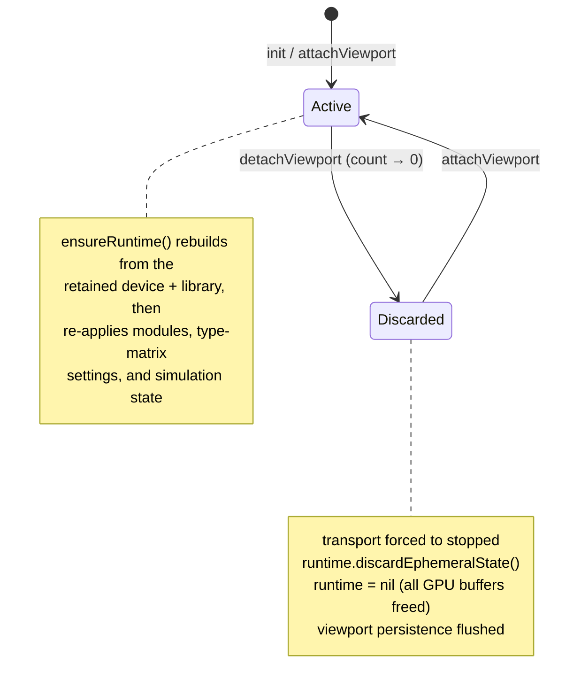
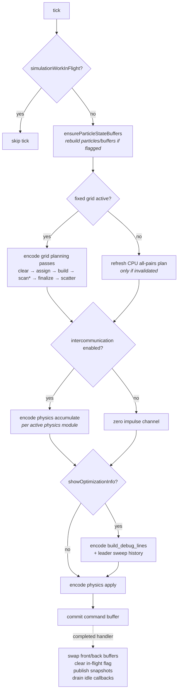
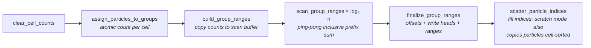

# 03 — Simulation Runtime

Two classes split the job:

- **`SimulationSession`** (`@MainActor`) — the long-lived facade the rest of the app talks to. Owns the Metal device + shared library, holds current state, and creates/destroys the runtime around viewport lifecycle.
- **`SimulationRuntime`** (`@unchecked Sendable`) — the actual engine. Owns all GPU buffers and compute pipelines, runs the 60 Hz tick on a private serial queue, and publishes lock-protected snapshots for the renderer.

`WindowSimulationSessionStore` (singleton) lazily creates the one main-window session, wiring its metrics and leader-log sinks into `MainWindowDiagnosticsStore`.

## Session bootstrap

`SimulationSession.create(...)` → `prepareBootstrap()` on a detached background task:

1. `MTLCreateSystemDefaultDevice()`
2. Concatenate shader source, in order: shared structs/helpers (`SimulationMetalSharedSource`) → default visual shaders (Swift string) → default physics (`Shaders/DefaultPhysicsModule.metal` bundle resource) → every packaged physics module's `.metal` (scanned via `PhysicsShaderSourceFiles.packagedPhysicsSources()` from `Modules/**/module.json`) → default optimization compute source → fixed-grid compute source.
3. Compile the single shared `MTLLibrary`.

The session then builds a `SimulationRuntime` from device + library and immediately applies the persisted editor configuration (resolved via `SimulationConfigurationDerivation` with transport `.stopped`).

## Viewport-driven lifecycle

The runtime only lives while a viewport is attached. `MetalViewportCoordinator` calls `attachViewport()` when the window becomes key and `detachViewport()` when it closes:

Consequences worth remembering: closing the window **hard-stops** the simulation and frees all particle state; the expensive part (device + library) survives, so reattach is cheap; `attachedViewportCount` supports multiple viewports in principle but the app currently has one.

`SimulationRuntime` also has a softer `suspendTicking(onIdle:)` / `resumeTicking()` pair (stops the timer without freeing state) with idle callbacks that fire once in-flight GPU work drains.

## The tick

A `DispatchSourceTimer` on `simulationQueue` fires every 1/60 s while transport is `.running` and ticking isn't suspended. Physics integrates with a **fixed timestep** (`1/60 × timeScale`) — the timer cadence controls real-time speed, the fixed step controls integration.

The leader (particle 0) gets special CPU-side treatment each tick: its interaction count and first target are read back from the plan buffers for the leader communication log and interactions/sec metric.

## GPU buffer inventory

| Buffer(s) | Owner concept | Notes |
|---|---|---|
| `particleFrontBuffer` / `particleBackBuffer` | Particle state | `ParticleState` = position/velocity/impulse (`SIMD4<Float>` each) + metadata (`SIMD4<UInt32>`: type, id, active). Double-buffered; swapped in the completed handler so the renderer always sees a consistent front buffer. |
| `interactionGroupIndicesBuffer`, `interactionRangeOffsetsBuffer`, `interactionRangeTargetsBuffer`, `interactionRangesBuffer`, `interactionIndicesBuffer` | **Interaction plan** (producer→processor contract) | Per particle: group → offsets slice → target ranges → particle indices. |
| `interactionScratchParticlesBuffer`, `interactionScratchToCanonicalBuffer` | Scratch read mode | Fixed-grid `scratch` mode writes cell-sorted particle copies for coherent reads; the reverse map recovers canonical indices. |
| `fixedGridCellCountsBuffer`, `CellOffsetsBuffer`, `CellWriteHeadsBuffer`, `CellScanBufferA/B` | Fixed-grid planning scratch | Counts → prefix scan (ping-pong log-stride passes) → offsets/write heads. |
| `typeMatrixInteractionBuffer` | Type-matrix physics | 32×32 `Int32` attraction/repulsion matrix. **Replaced wholesale, never mutated in place** — in-flight command buffers keep their old snapshot. |
| `typeMatrixSidecarFrontBuffer` / `BackBuffer` | Type-matrix physics | Per-particle sidecar (teleport accumulation, interaction fuel), double-buffered alongside particles. |
| `debugLineBuffer`, `debugLineSegmentBuffer` | Debug visualization | Leader sweep line vertices + segment table (history capacity 8, ~0.11 s visibility). |

### Invalidation flags

`needsParticleRebuild` (particle count / distribution / type count changed) and `needsInteractionPlanRefresh` (optimization module, grid topology, or read mode changed) are set by `applySimulationState` / `updateActiveModules` and consumed at the top of the next tick. Stopping the transport calls `abandonEphemeralState()` — everything above is nil'd and both flags set, so **stop → start is a full respawn**. Particle spawn itself is CPU-side (`DefaultPhysicsModuleRuntime.rebuildParticles`): seeded-random or lattice distribution in the unit cube.

## The two optimization strategies

**Default all-pairs** (`DefaultOptimizationAllPairs`): CPU builds a trivial plan — one group containing every particle — uploaded once per particle count. O(n²) interactions; validation caps it at 65,535 particles.

**Fixed grid** (`Fixed Grid Optimization Module`): the cube is divided into `subdivisions³` cells. CPU precomputes a static **topology** (which cells neighbor which, controlled by `subspaceCap`, wrap-around) cached per settings; per tick, six GPU passes bin particles into cells and build the dynamic plan:

`neighborReadMode` selects `raw` (physics reads canonical particle buffer via indices) or `scratch` (reads the cell-sorted copy — better memory coherence — resolving canonical indices through the reverse map only when needed).

## State application semantics

`updateSimulationState` is applied **synchronously** (queue-sync) when the target transport isn't `.running` — so pause/stop take effect before the call returns — and asynchronously while running. If called from the sim queue itself it applies inline. Module changes (`updateActiveModules`) are always queue-sync and throw on incompatibility. Transitions have side effects: stopping abandons state; disabling debug overlays resets debug history; starting type-matrix physics uploads (optionally re-randomized) matrix values.

## Outbound data

- **Snapshots** — `renderState` (front particle buffer + counts + debug segments) and `simulationState`, republished after every tick/change; read by `Renderer` under `snapshotLock`.
- **Metrics** — `SimulationMetricsAccumulator` batches FPS (fed in by the renderer via `publishFrameMetrics`), UPS, leader interactions/sec, and resident memory; published to the MainActor sink (→ `MainWindowDiagnosticsStore`) every 0.25 s over a 3 s window.
- **Leader communication log** — ring of up to 160 entries, published to its sink whenever it changes.
