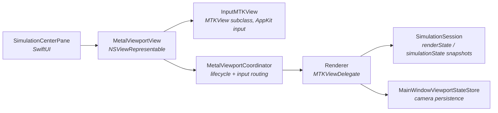
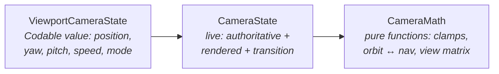

# 04 — Rendering & Viewport

The render side is deliberately thin: it *reads* simulation snapshots and *never* mutates simulation state (except forwarding camera-independent state calls). Ownership chain:

## Input path

`InputMTKView` overrides the AppKit event methods (mouse, scroll, magnify, key, indirect trackpad touches) and forwards them through the `InputMTKViewDelegate` protocol to the coordinator, which routes to the renderer:

| Input | Effect |
|---|---|
| Drag (mode-dependent: click-and-drag vs click-then-drag, per `ProgramSettingsStore.orbitInputMode`) | Orbit motion (orbit mode) or rotate-in-place (navigation mode) |
| Scroll | Adjust camera movement speed (exponential), persisted to viewport store |
| `W A S D Q E` (held-key set) | Navigation translation / orbit motion per frame |
| `F` | Reset camera |

`DragInteractionState` implements the click-then-drag arming state machine (also reused by the panel-drag UI, doc 06).

## Window lifecycle → simulation lifecycle

`WindowLifecycleObserver` (inside `MetalViewportView.swift`) watches the hosting `NSWindow`:

- `didBecomeKey` / `didDeminiaturize` → `coordinator.windowDidBecomeActive()` → `session.attachViewport()` (runtime created/resumed).
- `willClose` → commit camera state, `session.detachViewport()` (runtime discarded — see doc 03), then posts `.rebuildViewport` so SwiftUI recreates the viewport if reopened.

This is the *only* place simulation lifecycle is driven from.

## The camera system (`RendererSupport.swift`)

Three layers of camera state:

- Two modes: **navigation** (free-fly, position clamped to ±2.5) and **orbit** (position constrained to look at origin, radius 0.12–2.5). Switching nav→orbit runs a 0.5 s lerped `CameraTransition` from the *rendered* state to a corrected legal orbit state; during a transition all inputs are ignored.
- `authoritativeState` is truth; `renderedState` is what's drawn (they differ only mid-transition).
- Persistence: every meaningful change publishes through `cameraStateSink` → `MainWindowViewportStateStore.updateLiveCameraState` (no disk write); explicit checkpoints (drag end, mode change, window close) call `checkpointCameraState` which debounce-persists (doc 05). `ViewportCameraState` decoding migrates a legacy orbit-only payload (radius → position).
- Optional **slow auto-rotation** (`slowRotationEnabled` on viewport state) resumes 3 s after the last manual interaction.

## Frame anatomy (`Renderer.draw(in:)`)

Runs at display rate on the MainActor, entirely decoupled from the 60 Hz sim tick:

1. Record frame time (`RendererFrameRateTracker`, 3 s window), process held keys / slow rotation / camera transition.
2. Grab `session.renderState` + `session.simulationState` (lock-protected snapshots — never blocks the sim).
3. Encode one render pass:
   - **Bounds wireframe** — the unit cube via `TSPWireframeGeometry`, line pipeline (`line_vs`/`line_fs`).
   - **Particles** — point-sprite pipeline (`particle_vs`/`particle_fs`) reading `ParticleState` directly from the sim's front buffer. Vertex shader computes screen-space point size from `sphereSize` and perspective; type → HSV rainbow color (`spectrumOffset` rotates the palette); fragment shader discards outside the circle. When `showOptimizationInfo` is on, non-leader particles are dimmed to 22 % / alpha 0.10 and use a read-only depth state so debug lines stay visible.
   - **Debug lines** — leader-sweep segments from `renderState.debugRenderSegments`, drawn per segment with fade alpha from `DebugLineFadeController` (0.045 s in / 0.12 s out).
4. Present, then feed the measured FPS back via `session.publishFrameMetrics` (the sim runtime folds it into the diagnostics metrics).

Render pipelines are built in `Renderer.init` from the session's shared `MTLLibrary` — the same library that holds all compute shaders, which is how visual module shader entry points and the shared `ParticleState` struct definition stay consistent between compute and render.

The small axis indicator overlay (`ViewportAxisIndicator` + `ViewportAxisModel`) is a SwiftUI `NSHostingView` layered over the Metal view by the coordinator, fed camera orientation via the same sink, with perspective tunables from `MainWindowDebugSettingsStore` (compass distance/strength).
