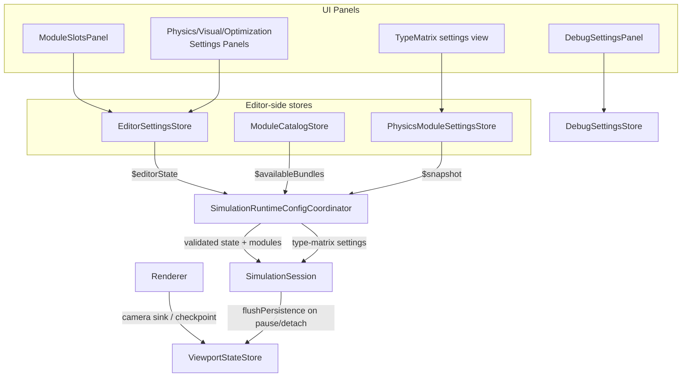
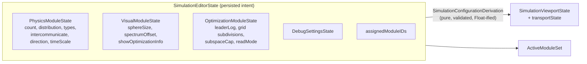

# 05 — State & Persistence

All persistence goes through one tiny generic, `CodableDefaultsStore<Snapshot>`: JSON-encode a `Codable` snapshot into a single `UserDefaults` key (writes serialized on a utility queue). Every store follows the same shape — a `@MainActor ObservableObject` singleton holding live state, with a snapshot type that owns the coding (including legacy-key migration in custom `init(from:)` implementations).

## Store inventory

| Store | UserDefaults key | Owns | Written when |
|---|---|---|---|
| `MainWindowSimulationStateStore` (+ facade `MainWindowEditorSettingsStore`) | `PhysicsSim.MainWindowSimulationState.v1` | `SimulationEditorState`: physics/visual/optimization/debug editor values + `assignedModuleIDs` | Immediately on every editor mutation |
| `MainWindowWorkspaceStateStore` (+ facade `MainWindowViewportStateStore`) | `PhysicsSim.MainWindowWorkspaceState.v1` | Camera state, scene objects, slow-rotation flag (not persisted) | Debounced 0.2 s; flushed on pause, window close, app quit |
| `MainWindowChromeStateStore` | `PhysicsSim.MainWindowChromeState.v1` | Dock panel layout, collapsed set, selected module, panel visibility, dock dimensions | Debounced 0.2 s; flushed on quit |
| `MainWindowPhysicsModuleSettingsStore` | `PhysicsSim.MainWindowPhysicsModuleSettings.v1` | Per-module opaque JSON blobs keyed by module name (currently only `TypeMatrixLocalAttractionRepulsion`) | Immediately on update |
| `MainWindowDebugSettingsStore` | `PhysicsSim.MainWindowDebugSettings.v1` | Axis-compass perspective tunables | Debounced 0.2 s |
| `MainWindowDiagnosticsStore` | — (in-memory only) | Performance metrics, viewport error, leader log, notification toasts (max 8) | n/a |
| `MainWindowModuleCatalogStore` | — (filesystem read) | `availableBundles` scanned from `Modules/` | n/a (read-only) |
| `ProgramSettingsStore` | via `@AppStorage` (`settings.viewport.*`, `settings.ui.*`) | App-level input preferences (scroll invert, orbit/panel drag modes) | Immediately via AppStorage |
| `WindowSimulationSessionStore` | — | Not really a store: the service locator that owns the session, coordinator, and hands out all the singletons above | n/a |

Two noteworthy migration paths hidden in the snapshots: `MainWindowSimulationStateSnapshot` decodes legacy `assigned*ModulePath` keys into module IDs (paired with `normalizeAssignedModuleIDs` at catalog refresh), and `MainWindowChromeStateSnapshot.normalized()` replaces recognized outdated default layouts (matched by signature) with the current default panel set.

## Who reads and writes what

`SimulationRuntimeConfigCoordinator` is the hub. Its three Combine subscriptions:

1. `editorSettingsStore.$editorState` → re-derive configuration → publish → apply to session if valid.
2. `moduleCatalogStore.$availableBundles` → first normalize legacy assignment IDs, then re-derive.
3. `physicsModuleSettingsStore.$snapshot` → decode + sanitize type-matrix settings → push straight to the session (module settings bypass the validation report; they're sanitized instead — `TypeMatrixLocalPhysicsSettings.sanitized()` clamps every field and repairs matrix dimensions).

It also owns the **transport state** (`startSimulation` / `togglePausePlay` / `stopSimulation`, gated on `validationReport.canStart`) — transport is deliberately *not* persisted; the app always launches stopped.

## Per-module settings pattern

`MainWindowPhysicsModuleSettingsStore` stores each module's settings as an opaque JSON string blob keyed by module name (`blobsByModuleName`). Typed access is provided by extension methods per module (see `TypeMatrixLocalPhysicsSettings` extension: `typeMatrixLocalSettings()`, `setTypeMatrixLocalSettings`, `regenerateTypeMatrix`, `setTypeMatrixValue`). This is the intended growth point for future module settings: new module → new `Codable` settings type + extension, no store changes. Note the runtime currently has a matching hardcoded delivery path (`session.updateTypeMatrixLocalSettings`) — a generic settings channel to modules doesn't exist yet.

## Data shape reference

`SimulationViewportState` is the flattened runtime struct: everything the runtime needs each tick in one `Equatable` value, so change detection (`previous.particleCount != next.particleCount` etc.) drives buffer invalidation cheaply.
