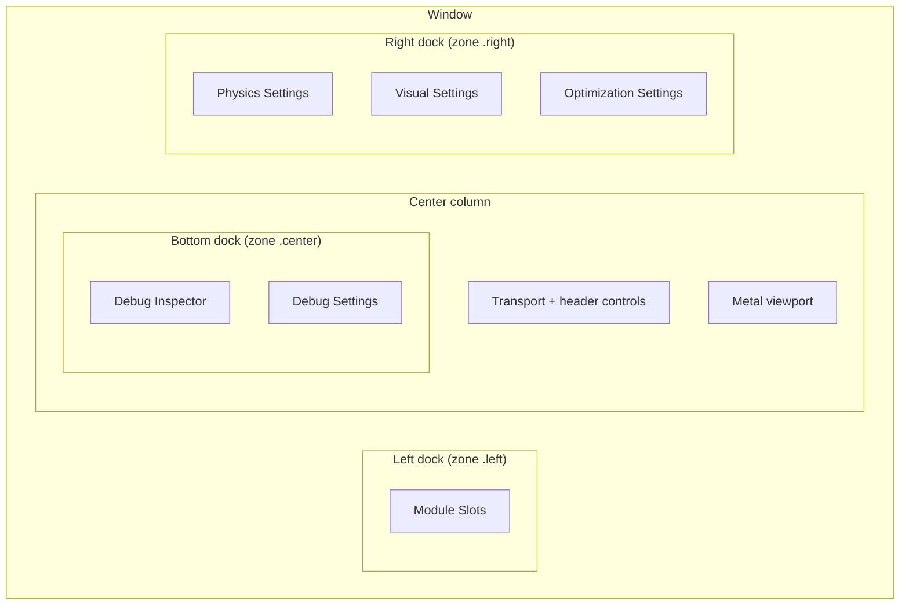
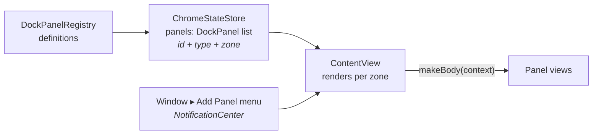

# 06 — UI Architecture

## Shell layout

`ContentView` (≈2,400 lines, the largest file) renders a three-pane layout via `PersistentThreePaneSplitView` (from `PersistentSplitView.swift`): left dock / center / right dock, with user-draggable widths persisted through `MainWindowChromeStateStore`. The center column hosts `SimulationCenterPane` — transport controls, the Metal viewport (`SimulationViewportSurface` → `MetalViewportView`), notification overlay, and the collapsible bottom (center-zone) dock.

(The panels shown are the defaults; users can add, remove, drag, and collapse panels freely.)

## The dock panel system

Panels are data, not hardcoded views. `DockPanelRegistry.definitions` is the single source of truth — each `DockPanelDefinition` declares a stable `DockPanelType` string ID, title, menu grouping (`DockPanelSubtype`: core / diagnostics / debug), an optional default zone, and a `makeBody` closure that builds the view from a `DockPanelRenderContext` (a bag of every store + coordinator, assembled by `ContentView.panelRenderContext(for:)`).

Registered panels: `moduleSlots`, `physicsSettings`, `visualSettings`, `optimizationSettings`, `moduleCatalog`, `inspector` (Debug Inspector), `leaderCommunicationLog`, `debugSettings`. Unknown persisted types are filtered out on load (`normalized()`), so removing a panel from the registry degrades gracefully.

Adding a panel: **App menu ▸ Window ▸ Add Panel** posts `.requestAddDockPanel` with the panel type; `ContentView` enters an insertion mode where clicking a zone places it. Moving panels supports both drag modes (click-and-drag with drop delegates; click-then-drag with a floating preview following the pointer), tracked by `PanelDragSession` + `DragInteractionState` and zone/panel frame preference keys.

## Panel → store wiring

Every panel is dumb: it renders store state and calls store setters; nothing talks to the runtime directly.

| Panel | Reads | Writes |
|---|---|---|
| Module Slots | catalog bundles, editor assignments, validation | `setAssignedModuleID`, `refreshModules` |
| Physics/Visual/Optimization Settings (`ModuleSettingsPanelView`) | editor state per kind, per-module settings | `setPhysicsState` / `setVisualState` / `setOptimizationState`, type-matrix settings |
| Module Catalog | catalog bundles, chrome selection | `setSelectedModuleID` |
| Debug Inspector | diagnostics metrics, validation, snapshot recorder state | start snapshot recording, toggle perf logging |
| Leader Communication Log | diagnostics log entries | — |
| Debug Settings | debug settings store | compass tunables |

Transport buttons call the coordinator (`startSimulation` / `togglePausePlay` / `stopSimulation`) and are disabled when `validationReport.canStart` is false.

## Eventually-applied controls

`EventuallyAppliedControls.swift` is the app's custom control kit. The core idea behind the `EventuallyApplied*` family (`Slider`, `IntSlider`, `Toggle`, `SegmentedPicker`): controls edit a **local pending value** and commit to the store on gesture end / focus loss, rather than pushing every intermediate value through the store → coordinator → validation → session pipeline. Sliders also support inline text entry with separate slider vs text-entry ranges (see `TimeScaleControlMapping`: slider 0–2, text 0–16, 0.25 runtime-scale per control unit).

## Validation surfacing

Two SwiftUI environment keys (defined alongside the controls) carry validation through the tree:

- `\.runtimeValidationReport` — the current `RuntimeValidationReport` from the coordinator.
- `\.highlightedValidationField` — a `RuntimeValidationField?` set when the user clicks an issue in the blocking-issues list, causing the matching control (via `ValidationControlDecoration`) to highlight.

Because `RuntimeValidationIssue`s are tagged with typed fields (`.particleCount`, `.assignedModule(kind)`, `.moduleSetting(moduleName:key:)`, …), any control can self-decorate when it is the cause of a blocked start.

## Menus, notifications, and cross-cutting events

App-level commands (in `PhysicsSimApp.commands`) use `NotificationCenter` to reach the view layer:

| Notification | Posted by | Handled by |
|---|---|---|
| `.requestAddDockPanel` | Window ▸ Add Panel menu | `ContentView` (insertion mode) |
| `.cancelInProgressOperation` | Escape key command | `ContentView` (cancels drags/insertion) |
| `.rebuildViewport` | `MetalViewportCoordinator.windowWillClose` | `SimulationCenterPane` (bumps `viewportGeneration` to force a fresh viewport) |
| `.testingAPICommand` | `TestingCommandHandler` (doc 07) | transport/window handling in the view layer |

The Settings menu edits `ProgramSettingsStore`-backed `@AppStorage` values (scroll-zoom inversion, orbit input mode, panel drag input mode). `ProgramSettingsCatalog` holds descriptors for a future full settings UI.
