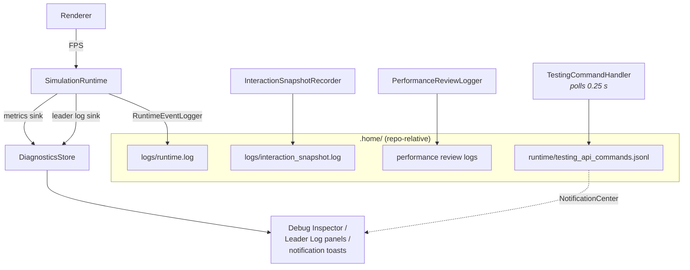

# 07 — Diagnostics & Tooling

All observability funnels either into `MainWindowDiagnosticsStore` (for the UI) or into files under `.home/` at the project root (for offline/agent inspection). Everything here is deliberately prototype-grade and repo-relative — noted in code comments as needing an app-owned location before shipping.

## Performance metrics

`SimulationMetricsAccumulator` (inside the runtime, doc 03) publishes `SimulationPerformanceMetrics` every 0.25 s: resident memory (Mach task info), average FPS (measured by the renderer, round-tripped through `publishFrameMetrics`), average UPS (physics steps/sec), and leader interactions/sec — all over a 3 s window. Sink → `MainWindowDiagnosticsStore.updatePerformanceMetrics` → Debug Inspector panel.

## Event logging — `RuntimeEventLogger`

Fire-and-forget line logger for lifecycle events (window attach/detach, type-matrix updates, testing commands). Keeps only the last 100 lines of `.home/logs/runtime.log` (read-modify-write on a serial queue).

## Interaction snapshots — `InteractionSnapshotRecorder`

A flight recorder for debugging UI↔runtime desync. Started from the Debug Inspector; records for 15 s at 10 Hz: full-state snapshots (`InteractionSnapshotState` — transport, coordinator state, session state, render state, editor states, validation, panels, metrics) interleaved with **events**. Instrumented call sites throughout the codebase call `InteractionSnapshotRecorder.shared.record(event:details:)` — these are no-ops unless recording (all the `ui.*`, `session.*`, `runtime.*`, `coordinator.*` event strings you see scattered around). Output: pretty-printed JSON at `.home/logs/interaction_snapshot.log`.

## Performance review logging — `PerformanceReviewLogger`

Opt-in long-horizon logger (toggled in the Debug Inspector): sparse periodic samples plus adaptive bursts after settings changes, written as rendered-text blocks (settings + metrics per entry) to per-run files under `.home`, with file rotation/cleanup. Flushed on app termination.

## Testing API — `TestingCommandHandler`

Enables external automation (tests, agents) to drive the app: polls `.home/runtime/testing_api_commands.jsonl` every 0.25 s, decodes appended JSON lines (`{"command": "start_simulation"}` etc.), and rebroadcasts via `NotificationCenter` (`.testingAPICommand`). Supported: `start_simulation`, `toggle_pause_play`, `stop_simulation`, `dump_state`, `close_main_window`, `open_main_window` (window ops via `WindowCommandCenter`). The app also prints `APP_READY` / `APP_HEADLESS_READY` to stderr for launch synchronization, and `PHYSICS_SIM_HEADLESS=1` runs a boot-and-quit smoke test.

## Crash & issue reports

`CrashReportImporter` scans macOS `DiagnosticReports` for app crash logs, dedupes against a UserDefaults set, copies new ones into `Sources/lab/data/issue_reports/crash_reports` (paths from `IssueReportPaths`), and posts a diagnostics notification. Validation reports share the sibling `validation_reports` directory. Both are explicitly prototype-only.

## Tests

`Tests/ParticularityTests/ModuleCompatibilityTests.swift` (swift-testing) covers the module compatibility matrix: default pipeline accepted, mixed execution models rejected, wrong pipeline slot rejected, debug-capability pairing, and custom realtime physics processor entry-point requirements. This is the natural home for the playback compatibility rules as the refactor lands.
