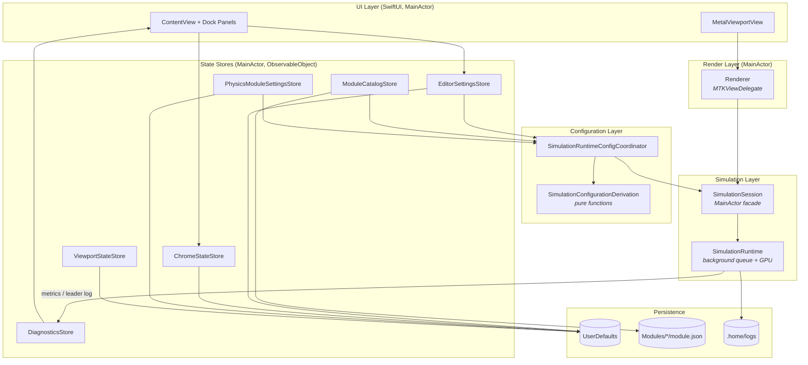

# Particularity — Architecture Documentation

Particularity is a macOS (SwiftUI + Metal) GPU particle physics sandbox. The app runs a compute-driven particle simulation on a fixed 60 Hz tick, renders it in a Metal viewport, and lets the user hot-swap the three stages of the simulation pipeline — **optimization**, **physics**, and **visual** — via a module system backed by on-disk module bundles.

These docs describe how the systems connect, not every type. Diagrams are Mermaid — they render in VS Code (with the Mermaid extension), GitHub, and most markdown viewers.

## Reading map

| Doc | Covers |
|---|---|
| [01 — System Overview](01-overview.md) | Big-picture map, directory layout, launch sequence, threading model |
| [02 — Module System](02-module-system.md) | **(Current refactor focus.)** Module kinds, execution models (realtime/playback), pipeline stages, manifests, discovery, resolution, compatibility, runtime dispatch |
| [03 — Simulation Runtime](03-simulation-runtime.md) | `SimulationSession`, `SimulationRuntime`, the tick loop, GPU buffers, interaction plans, lifecycle |
| [04 — Rendering & Viewport](04-rendering-viewport.md) | `Renderer`, `MetalViewportView`, camera system, input handling, debug line rendering |
| [05 — State & Persistence](05-state-persistence.md) | Every store, what it owns, where it persists, and who reads it |
| [06 — UI Architecture](06-ui-architecture.md) | `ContentView`, dock panel system, `DockPanelRegistry`, eventually-applied controls, validation surfacing |
| [07 — Diagnostics & Tooling](07-diagnostics-tooling.md) | Metrics, loggers, interaction snapshots, testing API, crash import |

## The system in one diagram

The one-sentence version: **UI panels mutate stores → a Combine-driven coordinator derives a validated runtime configuration from store state → the configuration is pushed into a session facade → the session forwards it to a background GPU runtime → the renderer pulls lock-protected snapshots from that runtime every frame.**

## Terminology cheat sheet

| Term | Meaning |
|---|---|
| **Module** | A swappable unit filling one pipeline slot (optimization / physics / visual). May be built-in or loaded from a `Modules/` bundle. |
| **Pipeline stage** | `producer` → `processor` → `presenter`. In realtime terms: optimization → physics → visual. |
| **Execution model** | `realtime` (live simulation) or `playback` (pre-baked; mid-refactor, not yet executable). |
| **Interaction plan** | GPU buffer set produced by the optimization stage that tells the physics stage which particles each particle may interact with. The core producer→processor contract. |
| **Transport state** | `stopped` / `running` / `paused` — the play controls. |
| **Editor state** | The user's *intended* configuration (particle count, module assignments, etc.), persisted, distinct from what the runtime is currently executing. |
| **Leader** | Particle index 0, used as the sampled subject for interaction debug visualization and logging. |
